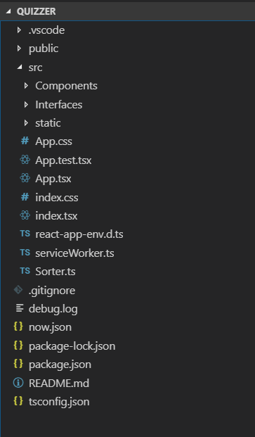
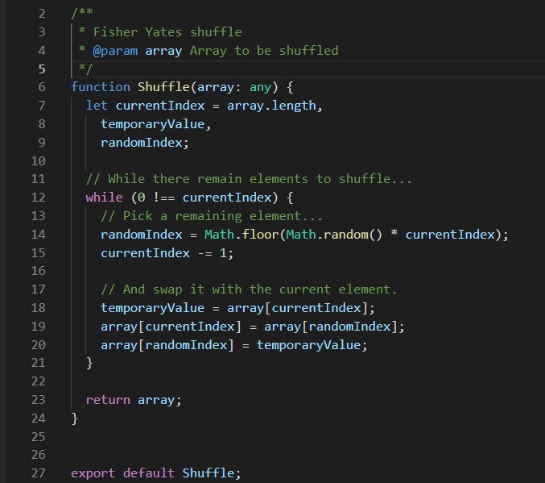
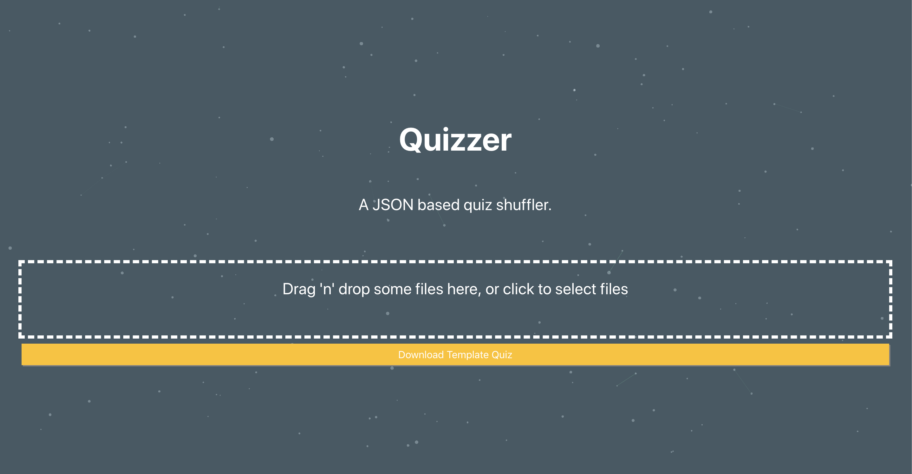
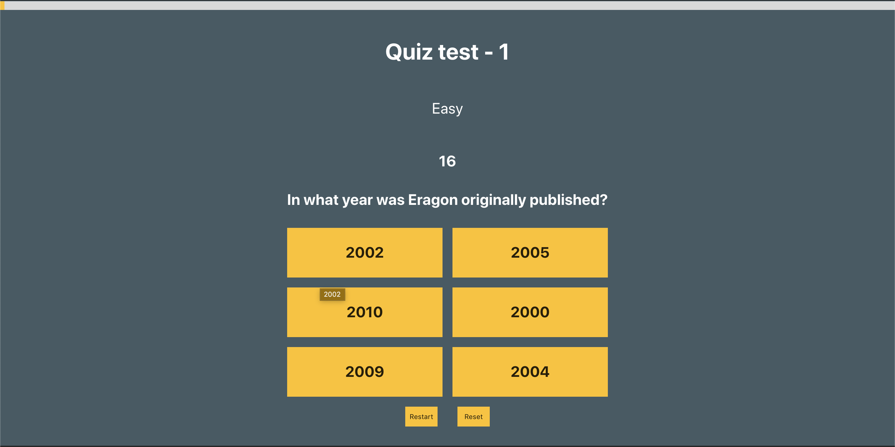
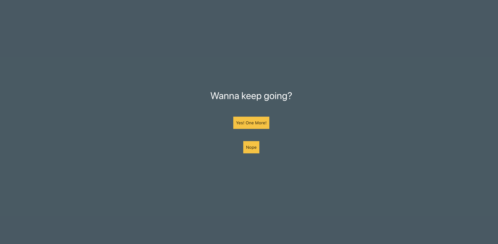
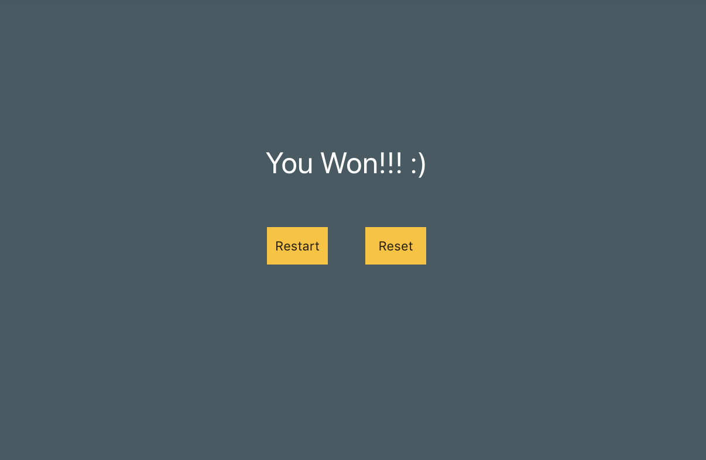

A JSON-based quiz shuffler.

## Why build this?

In a conversation with my brother he told of an event he was organizing which required that they made a quiz. When I heard he wanted to do it, somehow, with Power Point I stopped and decided to try and make something useful for him.

## But what did he really want?

With the goal of helping him I started by making some questions. In the end we agree on the follwoing requirements:

1. See a question and give the ability to choose between 2 or more answers.
2. Randomize the questions that appeared on each play.
3. Divide the questions by phases of difficulty.
4. Set timer for each questions.
5. Enable the user to give up after each question.

## What stack should I use?

- React (react hooks)
- Create-react-app with typescript
- Css in JS
- Netlify

## How did I organize the code?

The create-react-app has a default structure as seen below.

I'm using VS Code as my IDE (the .vscode folder is created to hold files for debugging among other things) and other files like package.json (node.js) and now.json (zeit now) are important but aren't specific to the application. The juice of the application is in the src folder. 

The application only has one router which points to the main component "Quiz".  This component is a [smart component](https://medium.com/@dan_abramov/smart-and-dumb-components-7ca2f9a7c7d0) which holds the quiz state. The other components are:

- Lost Game - Presents the final message.
- Progress - A thin layer to track how long it is on the quiz
- PhaseBuilder - holds the quiz info
- Question - holds the question info
- QuizOption - show the question options

Finally, as the questions needed to be shuffled, for each phase, I've added a shuffer based on Mike Bostock's implementation of the Fisher Yates algorithm. It's simple and works.

Shuffer of the questions (kudos to Mike Bostock [https://bost.ocks.org/mike/shuffle/](https://bost.ocks.org/mike/shuffle/))

To import the quiz I decided to simplify and do two things. Define the quiz as an interface using typescript and import it as a JSON file.

The quiz has the following structure 

    export interface Quizzer {
    	Title,
    	TimerSeconds?,
    	GiveUp?,
    	Phases: [
    		Phase,
        NumberOfQuestions,
        Questions: [
    			Question,
    			Image?,
    			Answers: [
    				Answer,
    				IsCorrect
    			]			
    		]
    	]
    }

In this structure it's possible to set a Timer for each question and let the user give up between questions. As the quiz might have multiple types of questions or just difficulties, the questions were divided by phases which might have only a set of questions that need to be answered.

Finally, and as a way to simplify the application, there are only one type of questions. Each one can have one image, and it's possible to set multiple options. I realize that with this structure it's possible to have multiple answers right but it simplified the application logic ¯\*(ツ)*/¯.

## Heck! I just want to see the final product

Yah I know, you want to know how it works and if it's any good. Well, this is super simplified with some quirks but for the following it works very well.

First, you are given this entry page. 

A beautiful  page I know

You can download the template file and edit as you wish. Just follow the structure set on previous section. After you're done, you can drag it to the drop zone and VOILÁ. The quiz starts.

You are given the basic info of the quiz, the question and options as seen below.

And then you're given a message to continue.

In the end. If you complete all question you are presented with this amazing message.

And that's it!!!

## Conclusions

This small application does the bare minimum set at the beginning. I've quickly deployed it to netlify and you can try it at [quizzer.cabeda.me](http://quizzer.cabeda.me). I'd like to clean a bit the code and add at least a quiz builder (might take a look into unform react library). It was also a good way to experiment with some technologies like react hooks and css  grid.