A conference in Porto is a good conference :-p

## Intro

Hi! I've attended Tech In Porto and I thought I'd write a brief summary of my experience. The conference started in 2017 and is organised by Jumia, an equivalent of Amazon but with origins in Nigeria. 

The conference was divided in two rooms and I've found that there weren't any talks that I wanted to attend happening simultaneously (kudos for that). Below you can find the entire program

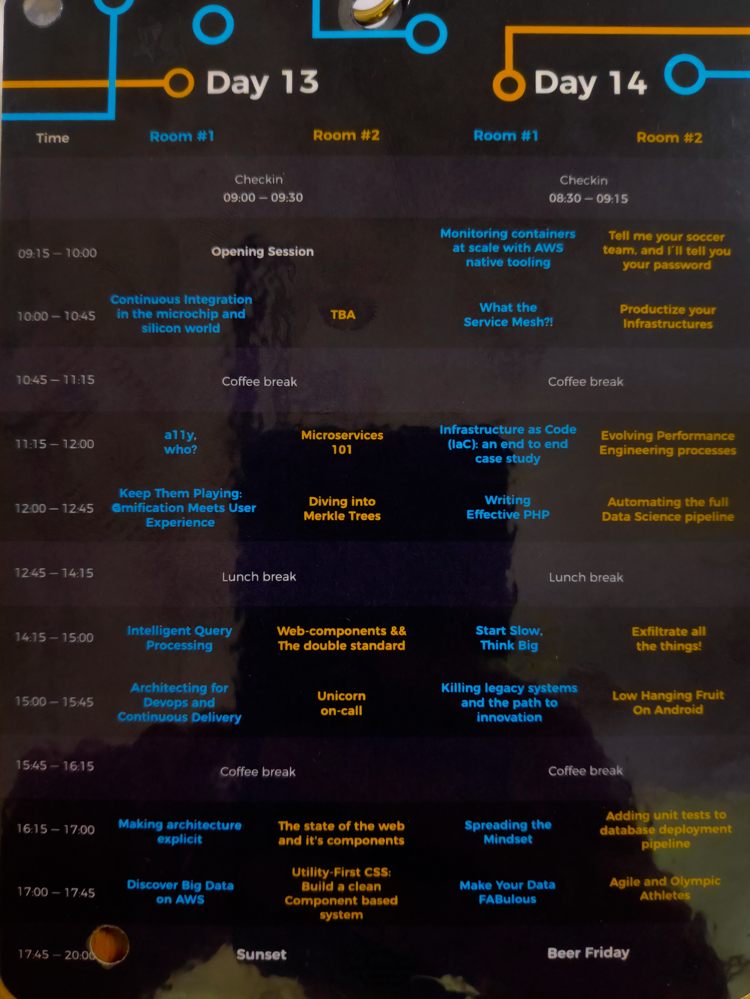

Has a bit of reflection I know. But please humor me and ignore it

Below are some of the notes I took of the talks I went. Some are more complete than others but, if you find one of the talks interesting you can watch the conference on their [youtube channel](https://www.youtube.com/channel/UC68_0ykcFWp8OOOpLXnJNPQ).

P.S: You can find the main website [here](https://techinporto.com/) and when the talks are uploaded to youtube I'll make sure to add the links

## Micro ships history

The first talk was all related to the history of microships. Not my area of expertise but it was cool to see the evolution from 1950 to today with examples such as Xbox One, which applies a technique called system on a ship. As the development of ships can take a long time from the first prototype until the discovery of flaws, engineers are starting to invest in the use of software to simulate hardware and speed up the process. The talk was presented by Carlos Palminha. You can check his Bio below.  

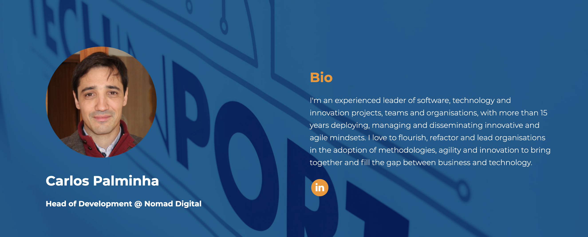

## Microservices 101

This talks was funny as it was the first time I saw an alummi of my year present at a conference. 

The talk was really an 101, with a brief presentation of Micro services, which are promoted as an evolution from monolithic arquitectures.  However there are some cons, being one of them a bigger overhead in the initial development phase and in management. Nonetheless for teams with a fast pacing and a certain size, I it can be a good fit. 

Afterwards, Neves presents three ways of migrating from monolithic to microservices being them:

- Change data capture
- Strangler pattern
- Branch by abstraction

They are all well suited for their use cases but I am frankly more inclined to the strangler pattern. 

At the end of the talk, we are presented with techniques for testing and monitor 
and monitoring (which are overlooked too many times).

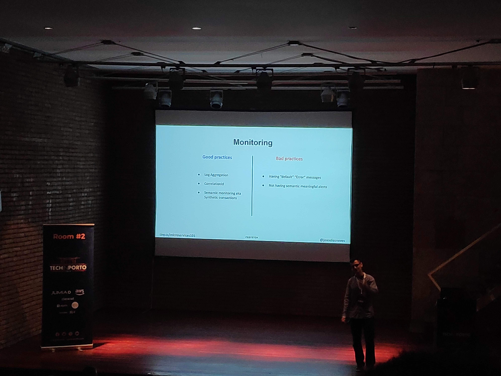

## Diving into Merkle trees

This was one of two talks given 
by Talkdesk (disclosure: company I work in) and was presented by Pedro Tavares. He starts by presenting a group he's in, Papers We Love, from where he found a paper called "A certified Digital Signature" from 1989, written by Ralph Merkle.

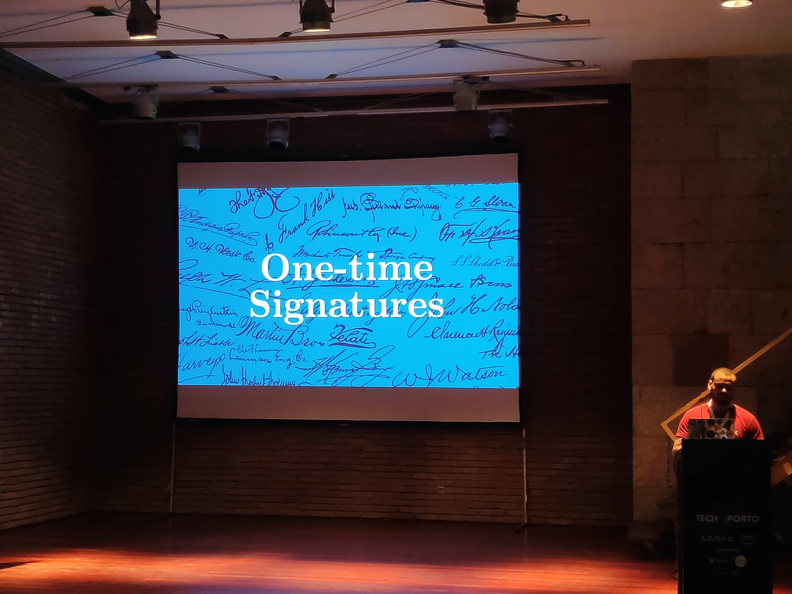

Merkle trees, from my understading of his talk, are binary tree of infinite number of cryptographic hashes with leafs pointing to data block. At first, this might seem to be just jargon but gradually I started to see it's importance. Some use cases are auditing of databases, peer to peer file transfer and copy on write. 

This talk might not be for everyone but I found it to be extremely interesting and I love when you have that Eureka moment where everything becomes clear.

## Intelligent Query Processing

I'd say Niko is the one with the most extensive experience in SQL. I truly liked its jokes and how he handled the crowd, making a talk that could very well put everyone to sleep, into one with very good tips and that pushed us to question the black magic of query planning.

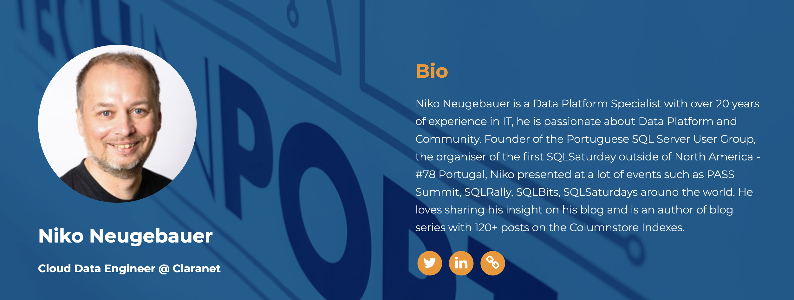

Had to leave his brief Bio here

Niko started by questioning our knowledge of how SQL works internally. There are proprietary versions like Oracle and SQL Server which have many optimizations not found on open source alternatives like PosgresQL

Some of the techniques used for the so called Intelligent Query Processing are in the image below.

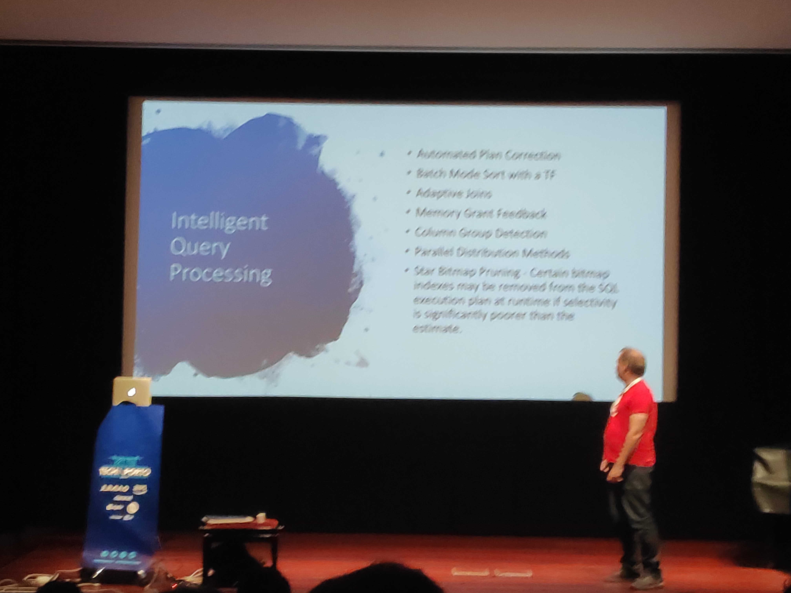

Sorry for the blur

Nonetheless, he also showed, with the help of pure math (not magical AI), that it's impossible to always choose the best plan to run a query. We have to be happy with a possible best. And sometimes it makes a mistake. On the image below you can see some of the examples presented by Niko.

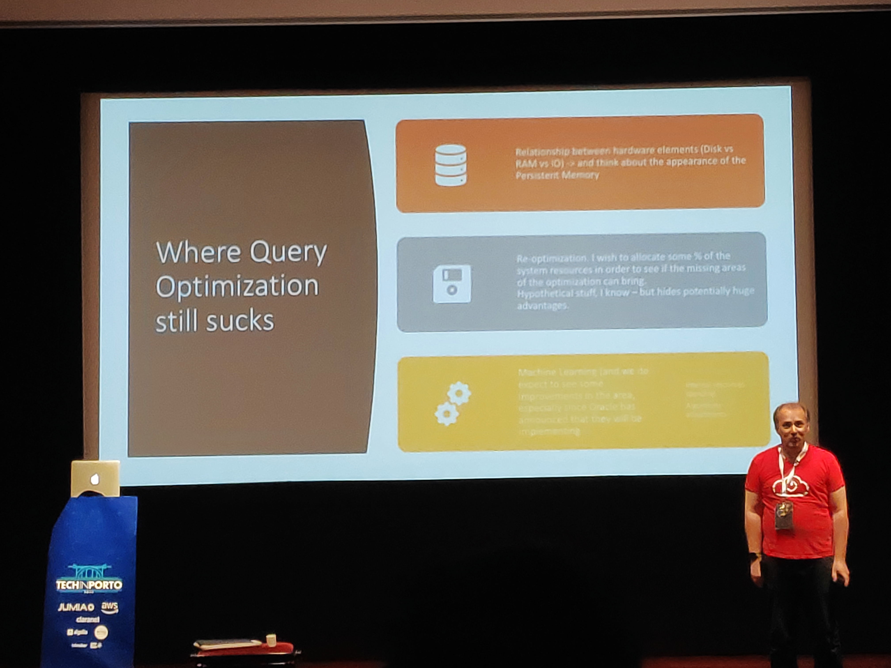

## Unicorn on-call

And this is the second talk from talkdesk, given by Pedro Torres. He has been working on improving the process of on-call engineers and proposes to guides us through the history of Talkdesk on-call with the help of Age of Empires game.

To that end, the talk was divided into 4 ages: Stone, Tool, Bronze and Iron.

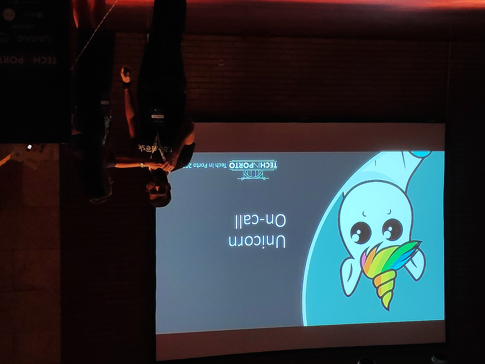

Some technical problems overlooked by an unicorn

Stone age was a period where, according to Pedro, even the CEO would come and help. If there was an alert, it was all-hands on deck. Next, the tool age started by implementing some tools to monitor the health of the system (ex: VictorOps) and setting up some processes (ex: blameless post mortem). However, with too much alerts and with even alarms on staging, there were even some cases of burn out.   

The bronze age was when talkdesk started to see some refinement. The team went from 2 engineers to 20,   acacio's list was introcuded (homage to Acácio cruz, SRE on google) and the shadowing program was created (a new recruit is set with a senior).

Finally, the next steps were presented. In the hope of making on-call rock, the gamification of the team is being introduced in a so called "Vanguard" program. One of the biggest improvements is the allocation of on-call engineers to a separate backlog where they set aside their normal work and instead focus on how to improve on-call and the systems resiliency.

The talk was very easy to follow and the idea that Pedro was trying to pass that on-call doesn't have to suck was very well understood and might have given some engineers ideas of how to improve the processes in their companies.

# Day 2

Second day, a new day!

## Service mesh

This was a talk I was very interested in as I have been listening to some [podcasts](https://softwareengineeringdaily.com/2019/06/06/service-mesh-interface-with-lachlan-evenson/) related to this new concept (new to me at least). 

The service mesh promises to solve some higher order problems that kubernets doesn't. One of the most recognised programs, and presented in this talk by Ricardo Castro is [Istio](https://istio.io/), developed mainly by google. 

In this service the main components are:

- Envoy
- Pilot
- Mixer
- Citadel
- Galley

After presenting the main components, Ricardo showed another aspect that makes this type of architecture interesting. Chaos testing. The main idea is that, by shutting down some nodes or components from the production system, we can check the resiliency of the system. I had only seen this being implemented by netflix and [gremlin](https://www.gremlin.com/) so it's nice to see this branch of engineering growing (but this isn't my area of expertise). 

Another idea presented was that of monitoring, that can be done with the help of Jaeger UI (and other alternatives). Finally, the presentation ended with how to get a snapshot of the mesh (called service graph). 

## Automating the full Data Science pipeline

The talk presented by Miguel Araújo, data science manager at Feedzai was an interesting one. He started by explaining the main business, fraud detection, and then went into showing some of the work done to automate data science (autoML) and improve the models  in the process. 

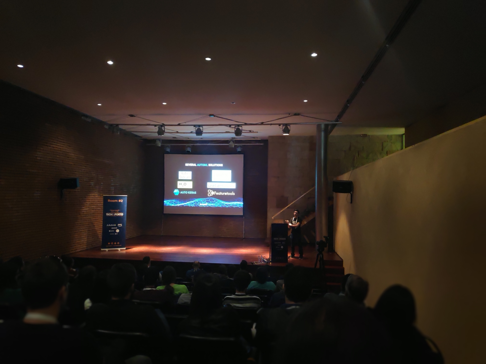

Some autoML services

There were three improvements that Miguel focused on. **Semantic aware feature engineering**, **automatic model selection** and **auto** **model monitoring**.

The first one, and what I deemed as the most interesting (again, my opinion) focuses on detecting the best possible features by tags automatically. This is called feature engineering and Miguel showed some numbers alleging that their methods (in the process of patenting) was much faster and worked at least as good as humans.

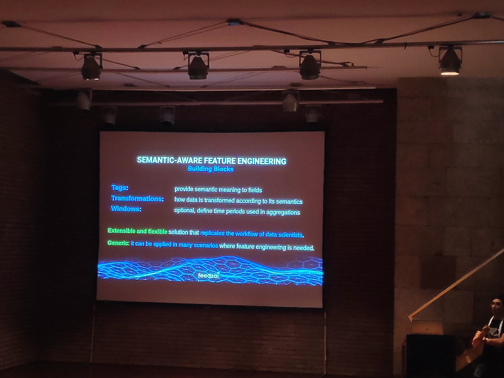

The second improvement, automatic model selection showed some odd results pointing to the fact that random search of the best model presented better results than a grid search. Finally, auto model monitoring tries to detect if the model keeps the same level of accuracy.

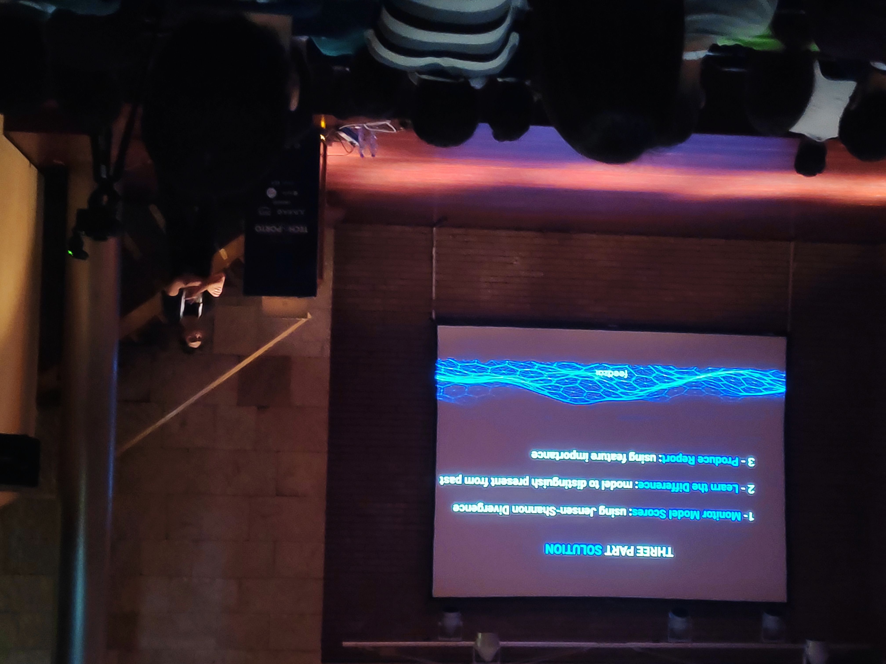

Key points of auto model monitoring

## Adding unit tests to database deployment pipeline

Todo

## Make Your Data FABulous

Todo

## Wrapping up

I found that some of the talks had new  and interesting ideas. The ones related to data were specially important for me but I don't think I found one that was specially mind blowing. There were some mishaps with the sound system but in the overall the conference was well organised and I hope there's more like this in Porto :-)

No better way to finish than with a beautiful image of Porto