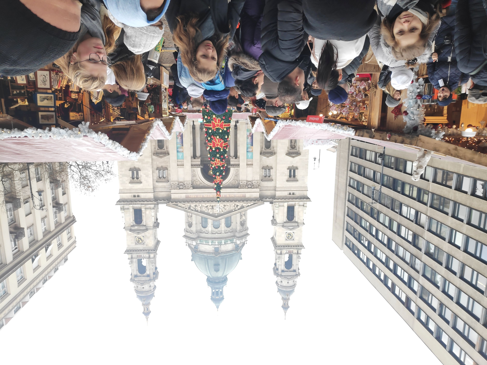

2019 was a good and challenging year. Looking back at the article [I wrote](../20190107-objectives-2019/index.md), it seems I've done more than I hoped (I'm a bit pessimistic at times).

Following the previous year structure I'll divide my review in the following categories:

- Work
- Entertainment
- Sports
- Travels
- Personal

The travels and personal were in an "Others" category but I've found them as important.

## Work

- Found a new place where I can call myself a Data engineer (with focus on analytics).
- Went to several meetups although I wasn't a regular on any of them
- Didn't write that much (two articles)
- Started learning german but really had a bad experience with it.

Looking at this I don't think I was that bad. Especially as I'm working on a company I truly like. In this field I've decided that I truly want to double down on giving back to the community.
My tech advisor gave me a special good advice that goes like this "Listen twice as much as you speak". As I've been mostly listening I'd say I'll need to start writing more, coding more on open source and really start giving some talks.
This might not be easy but I hope to get there.

## Entertainment

In terms of entertainment I'm starting to get good on the "don't start a new series or movie when I don't have a thing to do". This is really important to me as I feel that I waste too much time on leisure.
On the reading side I read 9 out of my objective of 12 books. Not bad considering I read "Designing data intensive applications". Really great book but a monster to read nonetheless with it's 562 pages. For this year I'll keep the same number of books. I'll just try to read more technical ones focusing on papers (a great habit I found on my current company).

## Sports

Well. This is a really sensible topic for me. I feel really great for being able to play soccer almost every week but the gym... I've tried to go, but my motivation was never really great without a gym buddy. After some months of going maybe 1x/week I completely stopped.

For this year I'll try to replace the gym with swimming (3x/week). Not going to be easy but hey! I'm 25 and need to keep my health in check.

## Travels

Last year, aside from visiting the main cities of Portugal, I was able to acomplish my goals. Got a really great experience out of Rome and Scotland and, as a bonus, went in December to Budapest. All trips were done on a tight budget so I was able to not break the bank.

For this year I'll try to enter a routine of a big and a small trip. There's nothing planned yet but I would really love to visit a country outside Europe and another on Europe.
As an extra I'd like to substitute a plane trip with a train. The experience is different but quite enjoyable.

## Personal

Don't have and don't plan to have any metrics to measure this but I've got around the habit of sometimes just saying yes to going out. Im not where I would like but I think I've found some really great friends that I'm trying to keep around.

Another thing I need to improve is my focus. To this end I'm really doubling down on deep focus (term coined by Cal Newport on his [book](https://www.goodreads.com/book/show/25744928-deep-work)).

## Summary

2020 is the year where I learn more by contributing to the community. There are things I completely failed and I'm taking a different approach (gym vs swimming) and others which I'm quite satisfied (travelled a bit through Europe).
Personally I'm trying to be a bit more relaxed and focused.

2020 will bring surprises for sure :-)
