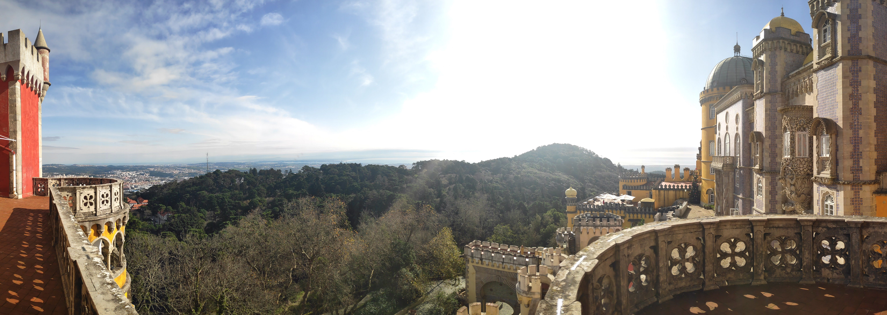

Just like most people I know (and at least half the world) the pandemic took hold of a big chunk of my life. Fortunately, I was able to cope with most of it but not with this blog which I haven't given a second of notice (I've only published an article on [talkdesk's](https://engineering.talkdesk.com/business-intelligence-a-road-from-staging-to-production-b708a662c668)).

For this year I'm hoping on giving it more time and focus. I'll give my best to keep it related to data engineering, analytics, and maybe some software engineering in general. As such, I've divided the article into the following topics.

- [Data Observability](#data-observability)
- [Programming Languages and frameworks](#programming-languages-and-frameworks)
- [Side Projects](#side-projects)
- [Organization](#organization)
- [Summary](#summary)

## Data Observability

In 2019 I set out on learning a lot but I didn't have a specific goal. Just some languages and frameworks. What was the consequence? I quickly lost my motivation.

For 2021 I've decided that I'll focus on improving data quality through data observability (you can read a bit about it in [this](https://towardsdatascience.com/data-observability-the-next-frontier-of-data-engineering-f780feb874b) great article).

When looking into some of the biggest gaps in Business Intelligence I've come to realize that the industry has been missing on a lot of DevOps and software engineering techniques such as good CI/CD, data tests and data lineage. Another missing point is the use of these pipeline's metadata and the infrastructure's metrics to implement a data-driven mindset. Some great tools have started to appear like [Great Expectations](https://docs.greatexpectations.io/en/latest/intro.html) and [DBT](getdbt.com/) to improve our data pipelines and I'm hoping that, by the end of the year I've got these in production in pair with airflow metrics (my colleague has published an article with an [overview](https://engineering.talkdesk.com/airflow-in-a-time-where-timing-is-of-the-essence-part-i-4089906334f8?source=rss----e6761a87bd8---4) of Talkdesk's BI architecture).

## Programming Languages and frameworks

For 2020 I've reinforced my knowledge of Python's internals. For 2021 I'll be reading more books and articles and I'll broaden my knowledge by learning Scala, a functional programming language heavily used in data teams.

As a bonus, I'd like to read more about Flink, Kafka and Rust.

## Side Projects

As side projects are just a way to test and do something fun, I'll try and focus on helping friends and family on their daily needs (I'm sometimes surprised by the things that can be automated in everyday lives). If possible, I'll try and do my projects on Scala, Python, and Javascript (in this order).

## Organization

Through the years I've tried multiple to-do lists. In 2020 I was trying to write everything on Notion (which I find great) but I found myself unable to make it work as a task app. At the middle of the year, as I was grasping with this issue, I read an article that set me on the right track (not sure where to find it sadly). Just write everything on your calendar!

And it worked. I'm using google calendar and, for now, I have the following flow.

1. As soon as I have an action that can't be done immediately, I write it as a reminder and set it to a specific time.
2. If it's something that needs to be synced with anyone else or needs to be absolutely done, I create an event.
3. At the end of each day, if I start accumulating tasks I reorganize them and try to understand what went wrong.

With this flow, I feel in better control of my day and don't feel bad when I see my huge task list. For this year I'm hoping that this will hold.

## Summary

2020 wasn't a bad year.

One of my personal goals was to work remotely and although I got there through a pandemic, this type of work suits me. However, for the rest of my goals I've slacked and 2021 needs to be a turning point. I'm hoping that by writing and talking more I'll become more accountable and, as consequence, realize them.
