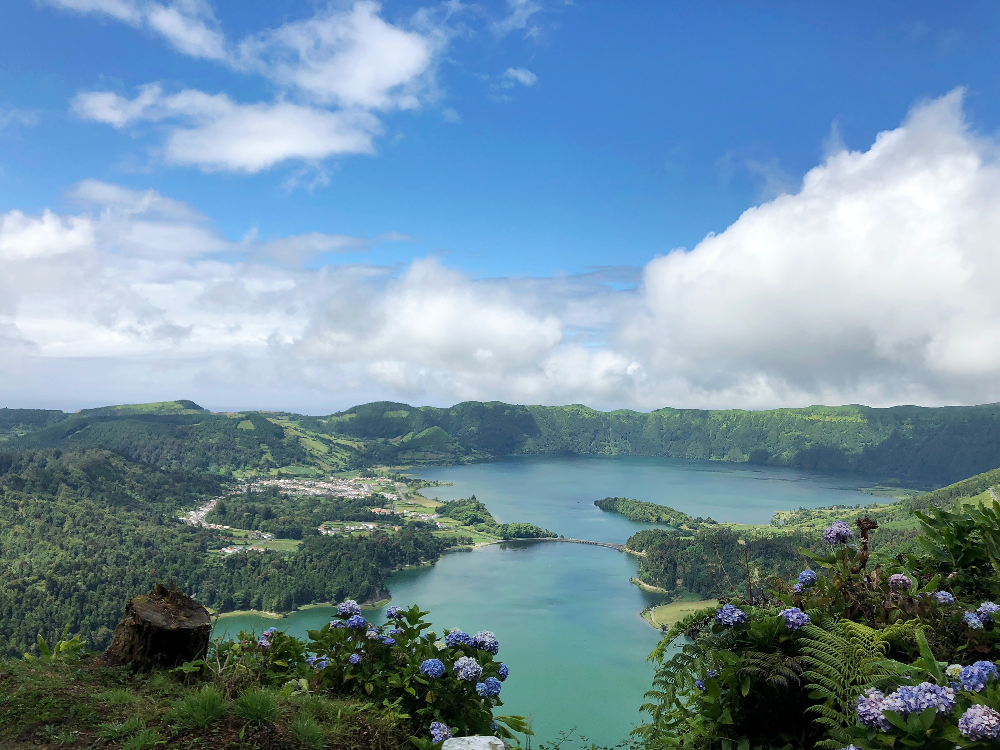

I'm going on vacations but before doing so decided to clean my to-read list. Kinda, I'm leaving most of what I found interesting below but got some useful conferences to wathc on python and some interesting ideas related to data lineage, metrics and data arquitecture overall. But I'll leave that for later 😅

- [Are We There Yet? The Query Your Database Can’t Answer](https://www.confluent.io/blog/ksqldb-streaming-sql-the-query-your-database-cant-answer/)
- [How to interpret PostgreSQL EXPLAIN ANALYZE output](https://www.cybertec-postgresql.com/en/how-to-interpret-postgresql-explain-analyze-output/)
- [Testing Airflow DAGs](https://www.astronomer.io/guides/testing-airflow)
- [Testing SQL](https://ianwhitestone.work/testing-sql/)
- [Amazon Timestream - Time series is the new black](https://www.allthingsdistributed.com/2021/06/amazon-timestream-time-series-is-the-new-black.html)
- [PostgreSQL 14 Beta 1 Released!](https://www.postgresql.org/about/news/postgresql-14-beta-1-released-2213/)
- [Containers are tents](https://increment.com/containers/containers-vs-vms/)
- [Analytics is a mess](https://benn.substack.com/p/analytics-is-a-mess)

Stay safe, stay well :-)
