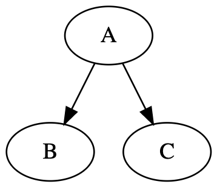
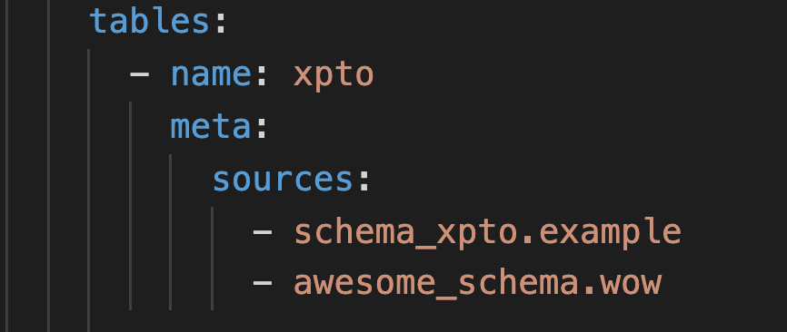
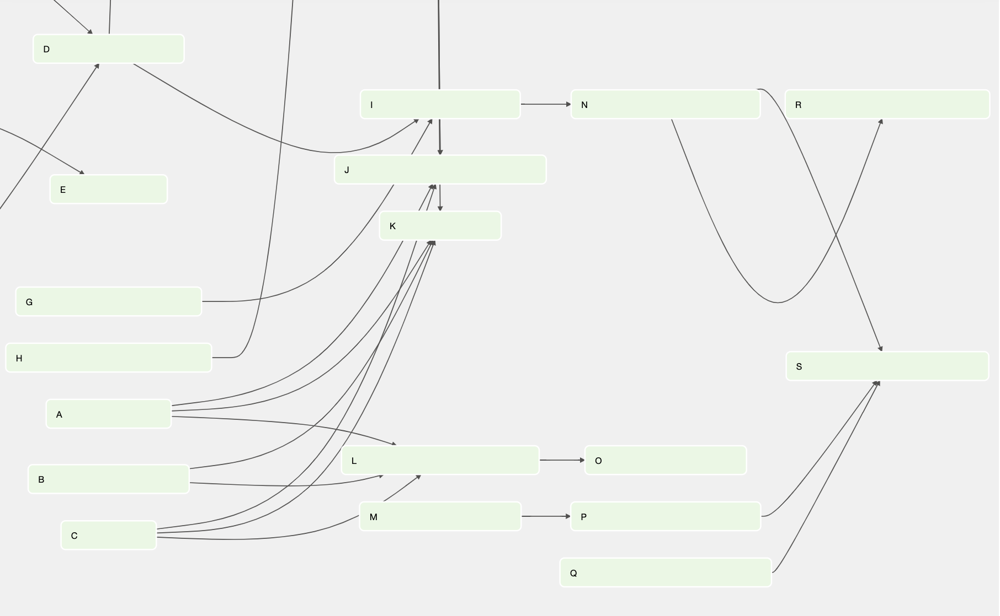

DBT is a great project but I've found myself in a kind of a situation. When we have a project that isn't entirely in DBT how can we generate a dependency graph from these? This type of graph defines for each table (represented as a node) which tables compose it (parent nodes) and which tables are populated by it (children nodes). This becomes very useful to understand the data model and to monitor it as we can understand in which data object is the error and to where it proposes.

## Enter DBT

So, in the context where we have a data pipeline project that is divided between DBT models and custom SQL Scripts we kinda feel spoiled by DBT's data lineage. We could try and migrate everything to it but it can take months or years and in the meantime, we get issues that need to be resolved. So how could we ease up this migration and start to leverage DBT for the other scripts?

By looking at DBT docs we can find an entity called [sources](https://docs.getdbt.com/docs/building-a-dbt-project/using-sources/) that defines it as:

> Sources make it possible to name and describe the data loaded into your warehouse by your Extract and Load tools.

This is actually what we are looking for as we can define all data that was set up outside DBT as sources and add them to the model. However, at the moment DBT doesn't have any way of manually defining the source's dependencies. For this, we need to develop some external code. 

## Data lineage on DBT Source tables

To actually be able to get a dependency graph we need to manually define the tables used to generate each table. Luckily, DBT has meta tags, a feature initially intended for adding custom sections for docs. In this example, we will leverage it and add a sources section in each table where we list all the parent nodes.

After having documented each external table in code, we need to create a custom way of generating the dependency graph as DBT will only use the meta tags to populate the docs. In my case, we are using airflow to orchestrate the DBT model and decided to create a script that, given the DBT sources it would generate a DAG with the table dependencies. Additionally, to make this dag actionable, each task is set to run the respective table's data tests.

## Next steps

The code above has been used multiple times to 1) understand the model and 2) debug the system. I've preferred to also add the dbt tests to the dags actually updating the table so that I could get immediate feedback if something was out of the ordinary but in case something occurs, the dag above proved to be way simpler than going over the SQL and understanding where the issue could be. And, if necessary I can develop a new test for the table and avoid a potential issue later.

In conclusion, If I had to improve something, it would be to extend the script so that the graph could be generated not only for sources but also for the DBT model just like it's shown in [this](https://www.astronomer.io/blog/airflow-dbt-1) astronomer's article. 