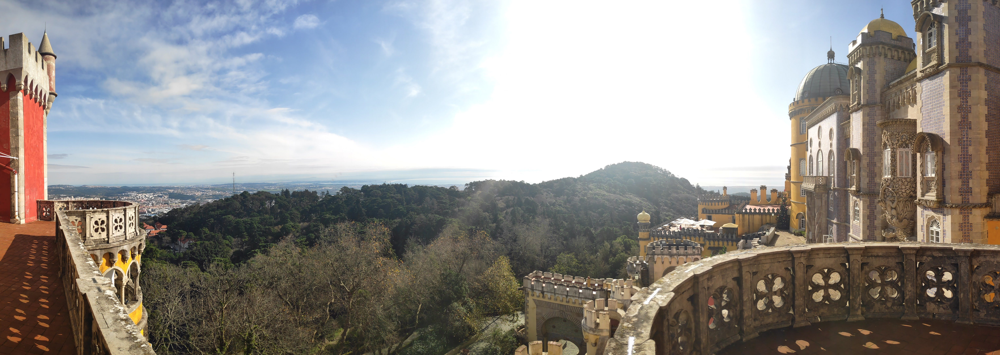

Just like most people I know (and seems like all world) the pandemic took hold of a big chunk of my life. Fortunately, I was able to cope with most of it. I haven't given a second of notice to this blog but I've published an article on [talkdesk's](https://engineering.talkdesk.com/business-intelligence-a-road-from-staging-to-production-b708a662c668)). For this year I'm hoping on giving it more time and focus. As such, while last year I talked about other things than technical themes I'll give my best to keep it related to data engineering, analytics, and maybe some software engineering in general. As such I've divided the article into the following topics.

- [Data Observability](#data-observability)
- [Programming Languages and frameworks](#programming-languages-and-frameworks)
- [Side Projects](#side-projects)
- [Organization](#organization)
- [Summary](#summary)

## Data Observability

In 2019 I set out to learn much but I didn't have a specific goal of what I wanted to improve. Just some languages and frameworks. However, this approach is wrong as you can quickly lose your motivation.

For 2021 I've decided that I'll focus on improving data quality through data observability. (you can read a bit about it in [this](https://towardsdatascience.com/data-observability-the-next-frontier-of-data-engineering-f780feb874b) great article).

When looking into some of the biggest gaps in analytics I've come to realize that the industry has been missing on a lot of DevOps and software engineering techniques. Without data tests we are mostly blind on our data pipelines. Without lineage we can't be sure of what is feeding each dashboard or report. And, without more metrics on the infrastructure we can't be sure of what data is being used and where we should improve performance. Some great tools have started to appear like [Great Expectations](https://docs.greatexpectations.io/en/latest/intro.html) and [DBT](getdbt.com/) and I'm hoping that, by the end of the year to have integrated these techniques to my day-to-day work.

## Programming Languages and frameworks

For 2020 I've reinforced my knowledge of python which, although it might be a simple language it has a lot to learn about if one wants to be proficient on it. As this is my main language for work I'll keep reading more resources but for 2021 I want to learn a functional programming language and I've set my eyes on Scala.

As a bonus, I'd like to read more about Flink, and Kafka and rust.

## Side Projects

As side projects are just a way to test and do something fun, I'll try and focus on home automation and helping friends and family on their daily needs (I'm sometimes surprised by the things that can be automated in everyday lives). If possible, I'll try and do my projects on scala, python, and javascript (in this order).

## Organization

Through the years I've tried multiple to-do lists. In 2020 I was trying to write everything on Notion (which I find great) but for tracking and acting on it I was lacking. At the middle of the year as I was grasping with this issue, I read an article that set me on the right track (not sure where to find it sadly). Just write everything on your calendar!

And it worked. I'm using google calendar and for now I have the following flow.

1. As soon as I have an action that can't be done immediately, I write it as as reminder/task and set it to a specific time.
2. If it's something that needs to be synced with anyone else or needs to be absolutely done, I  create an event.
3. At the end of each day, if I start accumulating tasks I reorganize them and try to understand what went wrong (usually something else came up which I write down on the calendar)

With this flow, I feel in better control of my day and don't feel bad when I see my huge task list. For this year I'm hoping that this will hold.

## Summary

2020 wasn't a bad year.

One my personal goals was to work remotely and although I got there through a pandemic, this type of work suits me. However for most of my 2020 goals I've slacked and 2021 needs to be a turning point. I'm hoping that by writing more and talking more I'll become more accountable and, as consequence, realize them.
