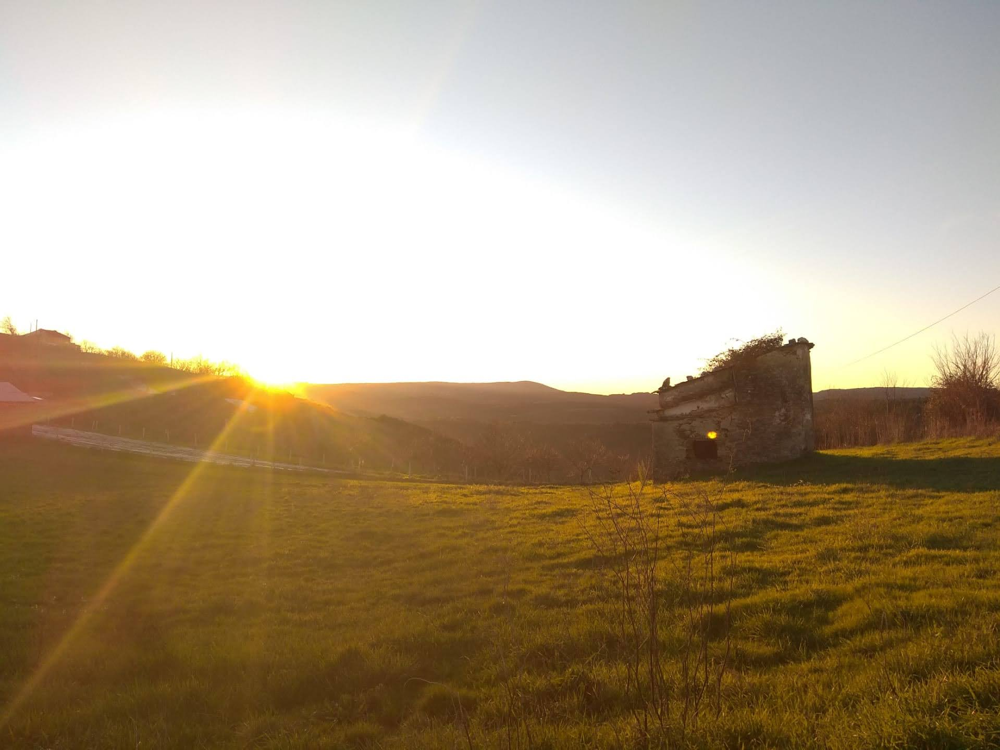

For the past weeks, I've found some interesting stories related to database migrations like [Your legacy database is outgrowing itself](https://ikonicscale.com/your-legacy-database-is-outgrowing-itself) and [An unlikely database migration](https://tailscale.com/blog/an-unlikely-database-migration/). The stacks are very different in each story but shows how challenging a migration is when you need to keep systems up and avoid data loss.
These kind of challenges will only increase in number with the move of processes to the digital realm, which foresees an increase of data engineers as stated on [We Don't Need Data Scientists, We Need Data Engineers](https://www.mihaileric.com/posts/we-need-data-engineers-not-data-scientists/) and in [How To Become a Data Engineer](https://khashtamov.com/en/how-to-become-a-data-engineer/).

Adobe has heavily invested in Apache Iceberg as written on [Taking Query Optimizations to the Next Level with Iceberg](https://medium.com/adobetech/taking-query-optimizations-to-the-next-level-with-iceberg-6c968b83cd6f). This table format looks promising, specially for those already using [presto/trino](https://trino.io/docs/current/connector/iceberg.html) and hive.

Some of the reasons to be excited about airflow 2.0 are explained on [Airflow 2.0 and Why We Are Excited at Databand](https://medium.com/databand-ai/airflow-2-0-and-why-we-are-excited-at-databand-b26605a3b9f4).

For the ones working with analysts, SQL is a must-have and even shows some strengths like those in [Simple Anomaly Detection Using Plain SQL](https://hakibenita.com/sql-anomaly-detection). However it presents some challenges like linting, which is still a work in progress but is seeing new developments like in [sqlfluff](https://www.youtube.com/watch?v=veYB9uh0RCM&feature=emb_title).

Be well and stay safe :-)
