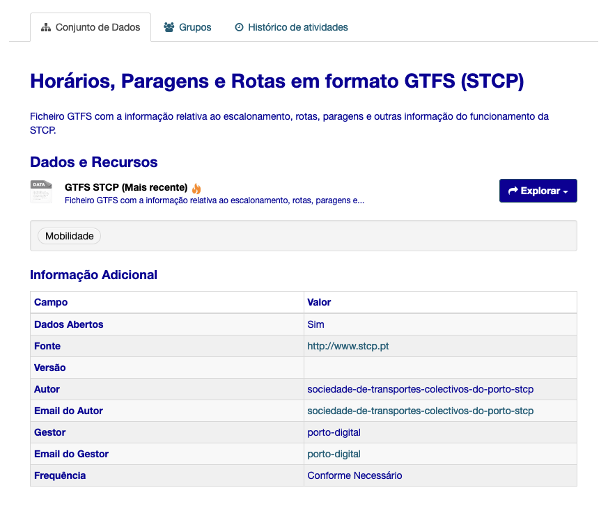
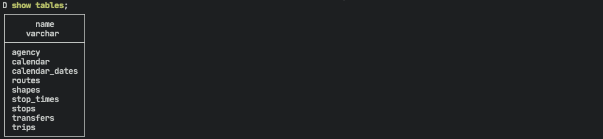

Goal: Show a good pratical use case using Duckdb for analysis.

I've been looking into playing with DuckDB for some time. For data/analytics engineers that got used to either using Postgres or data warehouses like Redshift (when I was not the one paying for it 😅) the introduction of DuckDB seemed very promising.

So what is DuckDB? If we go to their [page](https://duckdb.org/) we get that it's "an in-process SQL OLAP database management system". In other words, it's an OLAP version of SQlite being able to be run on different environments like python, R, or, through the shell without requiring complex deployments. For analysis that can reside on a single computer, it states to be very performant and with the addition of built-in tools to read from CSV, parquet, or, even directly from [postgres databases](https://duckdb.org/docs/extensions/postgres_scanner.html). Another great feature I'd like to add but we won't be testing on this article is the easiness of importing and exporting pandas dataframes, one of the features making it so popular. With this said, let's give it a try!

## Installation

For this article, I'm testing with a Macbook Pro M1, and will be running version 0.6.0. To install you can do as below

```shell
wget https://github.com/duckdb/duckdb/releases/download/v0.6.0/duckdb_cli-osx-universal.zip

unzip duckdb_cli-osx-universal.zip

```

With the above we can now use DuckDB by simply running on the terminal we unzipped `./duckdb`. However, as I want to run Duckdb in more than one folder I've installed using the Homebrew command `brew` install duckdb `which makes the executable accessible system-wide with the command` duckdb.

## Source of data

I've been looking into analyzing the schedule of local public transportation. Luckily, the municipal chamber has an open data portal where we can find a [dataset](https://opendata.porto.digital/dataset/horarios-paragens-e-rotas-em-formato-gtfs-stcp) with exactly what we need (the portal is in Portuguese).



I proceed to transfer it but you can do the same with the following commands:

The zip contains 9 files:

- routes.txt
- calendar.txt
- stops.txt
- trips.txt
- shapes.txt
- stop_times.txt
- calendar_dates.txt
- agency.txt
- transfers.txt

After opening them, I see they are all with a CSV so we can just read the data directly from the files using the `read_csv_auto`.


This is great but Hey! We don't want to keep reading from the files. So we need to import them using the script below:

```sql{numberLines: true}
create table routes as select * from read_csv_auto('routes.txt');
create table calendar as select * from read_csv_auto('calendar.txt');
create table stops as select * from read_csv_auto('stops.txt');
create table trips as select * from read_csv_auto('trips.txt');
create table shapes as select * from read_csv_auto('shapes.txt');
create table stop_times as select * from read_csv_auto('stop_times.txt');
create table calendar_dates as select * from read_csv_auto('calendar_dates.txt');
create table transfers as select * from read_csv_auto('transfers.txt');
create table agency as select * from read_csv_auto('agency.txt');
```

After running this command, you can check the tables you created with `show tables`.



Additionally, duckDB can store all data by creating a single \*.duckdb file. This works in the same way as Sqlite and only allows for a single writer (only concurrent readers are permitted). To do this, you run `.open main.duckdb` which either creates a new file or opens an existing one. From this point on, everything you do is stored on the file.

This reminds me that if you run `show tables` again, you'll see the tables you created don't exist anymore 😅. You need to run them again but now you won't lose a thing 🙂.

## Analysis of the data

With the data inserted into our database an stored on main.duckdb, we can proceed to analyze our dataset. If

> How many lines do we have?

> What is the frequency of the buses?

## Conclusion

1.  Delay of buses
2.  Add metro timeline
