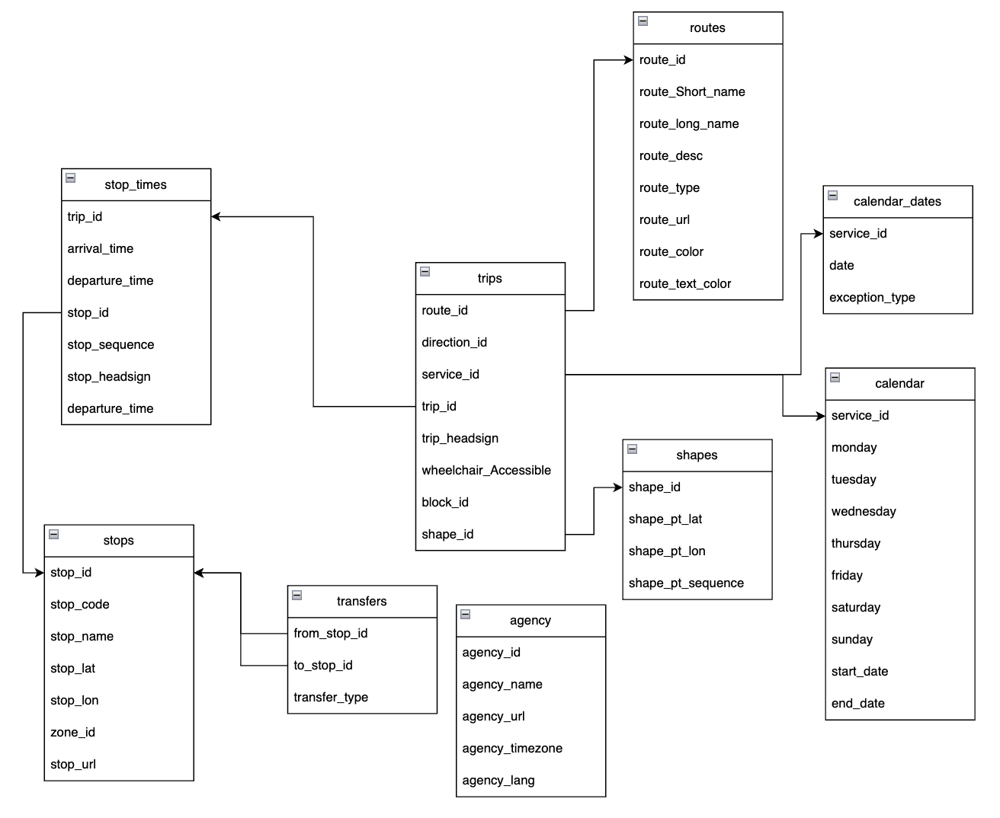
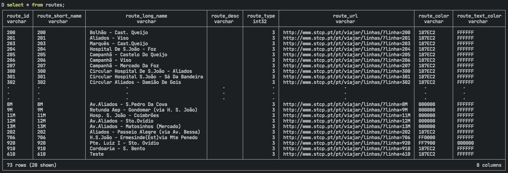
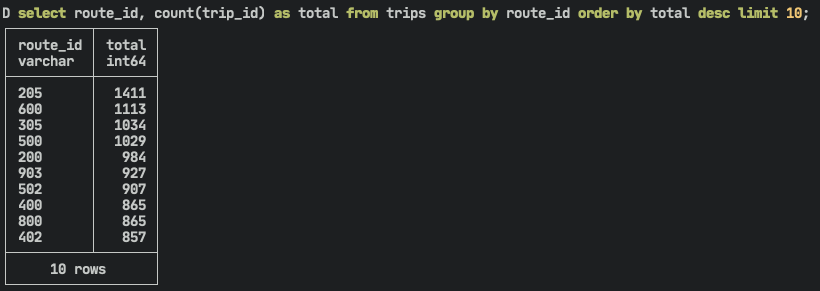
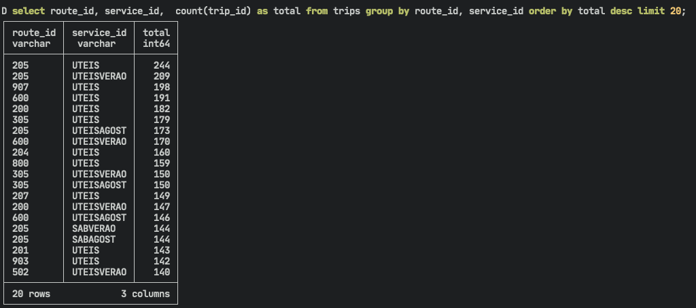

A new database, DuckDB, has seen a rise in popularity, in recent years. Other alternatives like Redshift are too expensive for many companies. In the open-source space, Postgres focuses on transactions, not data analysis. Clickhouse has a complex architecture to handle data on the same scale as Redshift. Would it be possible to have a small and lean database for analysis the same way we have Sqlite? At first, I didn't understand its appeal, but I decided to take it for a test. It might just prove to be great for quick analysis and as an alternative for data platforms.

## Duck what?

So what is DuckDB? If we go to their [page](https://duckdb.org/) we're presented with:

> "DuckDB is an in-process SQL OLAP database management system".

In other words, this means we can just execute a file, import data, and analyze it. We don't need complex distributed systems as long as it runs on a single machine (looking at you Spark). The documentation shows it has built-in tools to read CSV, Parquet, and Postgres tables. This looks promising already so let’s put it to the test!

> **Note**: DuckDB can run inside python, read and write pandas dataframe. This is one of the features making it so popular in the Python community! Yet, to remain focused, I'll leave this for another article.

## How can I install it?

For this article, I'm testing with a Macbook Pro M1 and will be running version `0.6.0`. To install it you can do as below:

```shell{numberLines:true}
wget https://github.com/duckdb/duckdb/releases/download/v0.6.0/duckdb_cli-osx-universal.zip

unzip duckdb_cli-osx-universal.zip
```

We can now use DuckDB on the terminal by calling the executable ./duckdb. But we can do one better and make the DB available system-wide with `brew install duckdb` (requires [Homebrew](https://brew.sh/)).

Run Duckdb from any console and now you'll be presented with a new session 🙂.

## Let's test it with some local data

For this test, I'll take the opportunity and analyze the schedule of my local public bus (Porto, Portugal 🇵🇹). Luckily for us, the municipal chamber has an open data portal. Searched a bit and found a [dataset](https://opendata.porto.digital/dataset/horarios-paragens-e-rotas-em-formato-gtfs-stcp) with exactly what we need (⚠️ the portal is in Portuguese).


We proceed to transfer it by clicking on the transfer button or you can run the following commands:

```shell{numberLines:true}
wget https://opendata.porto.digital/dataset/5275c986-592c-43f5-8f87-aabbd4e4f3a4/resource/1f845744-1962-4108-a20c-ac3357d0957b/download/gtfs-stcp.zip

unzip gtfs-stcp.zip
```

The zip contains 9 files:

- routes.txt
- calendar.txt
- stops.txt
- trips.txt
- shapes.txt
- stop_times.txt
- calendar_dates.txt
- agency.txt
- transfers.txt

Although they are text files, after opening them we can see that they follow a CSV format. This is great as DuckDB has a native function `read_csv_auto` to reads these files.


This is a nice feature but we don't want to import the files each time we run a query. So, the next step is to create a table for each file:

```sql{numberLines: true}
create table routes as select * from read_csv_auto('routes.txt');
create table calendar as select * from read_csv_auto('calendar.txt');
create table stops as select * from read_csv_auto('stops.txt');
create table trips as select * from read_csv_auto('trips.txt');
create table shapes as select * from read_csv_auto('shapes.txt');
create table stop_times as select * from read_csv_auto('stop_times.txt');
create table calendar_dates as select * from read_csv_auto('calendar_dates.txt');
create table transfers as select * from read_csv_auto('transfers.txt');

-- For some reason this file requires the additional parameter to detect the headers
create table agency as select * from read_csv_auto('agency.txt' , header=True);
```

After running this command, you can check the tables you created with `show tables`.


Neat 🤌🏼 But...

What would happen if you close the shell or the computer shut down? Well, we'd lose everything sadly. To solve this, DuckDB can store all data by creating a single \*.duckdb file (very similar to how SQLite works). This means no concurrent writers are allowed (only readers). Bu,t for our use case, it’s not something to bother us.

So, for us to advance in our test we'll execute `.open main.duckdb`. This command either opens an existing file in the current directory or creates a new one. From this point on, everything you do is stored for all eternity. Or until you delete the file. Or the hard drive goes kaboom. Whatever comes first 🧨.

This reminds me that if you run `show tables` again, you'll see that the tables you created don't exist anymore 😅. This is because up until we run `.open`, we were storing everything in memory. You need to run the commands above again. With this, when we want to return to this database, we just run `duckdb main.duckdb`.

Simple and clean, don't you think?

## What can we do with DuckDB?

With the steps above, we can proceed to analyze our dataset. For this test, I came up with 2 questions:

1. How many routes do we have? And stops per route?
2. What is the frequency of the buses?

To answer these we should first check the schema of our tables (for this article I draw this one manually).



> How many routes do we have? And stops per route?

For this first question, we can check the table routes with a select statement.



The first column is named a route_id which, if unique, will correctly point us to how many lines we have. For that we run both queries:

```sql{numberLines:true}
select count(*) from routes;

select count(distinct route_id) from routes;
```

Both return 73 so we can safely say that in Porto there are 73 routes. But how many stops do we have per line?

```sql{numberLines: true}
create table route_stops as
with stops_routes as (

    select distinct (
    routes.route_short_name,
    stop_times.stop_id) as routes
    from
        trips
    inner join routes
        on trips.route_id = routes.route_id
    inner join stop_times
        on stop_times.trip_id = trips.trip_id
)
select
    routes.route_short_name as routes_name,
    count(routes.stop_id) as total
from stops_routes
group by routes_name
order by total desc;

-- Linted with sqlfluff
```

Now we get a nice table with the results. Now we get a nice table with the results. From this table, we learn that the average number of stops is 70. And that it can go as little as 21 (routes [920](https://www.stcp.pt/pt/viajar/linhas/?linha=920) and [910](https://www.stcp.pt/pt/viajar/linhas/?linha=910)) to 121 (routes [508](https://www.stcp.pt/pt/viajar/linhas/?linha=508) and [603](https://www.stcp.pt/pt/viajar/linhas/?linha=603)). All this using aggregation functions avg, min, and, max.

```sql{numberLines:true}
select avg(total) from route_stops;
select min(total) from route_stops;
select max(total) from route_stops;

-- To get exactly which routes have the fewer and most stops respectivelly
select * from route_stops order by total asc limit 10;
select * from route_stops order by total desc limit 10;
```

> What is the frequency of the buses?

To answer this question we can look at the trips table.

```sql{numberLines:true}
select
    route_id,
    count(trip_id) as total
from trips group by route_id order by total desc limit 10;
```



This is all nice, but it would be more useful if we distributed the trips by the different periods. To keep it simple, we can use the service_id which defines the "type" of weekday:

- UTEISAGOST: weedkday in august
- DOMAGOST: sunday august
- UTEIS: weekday
- DOM: Sunday
- SAB: Saturday
- SABVERAO: Saturday during summer
- DOMVERAO: Sunday during summer
- UTEISVERAO: weekday during summer

```sql{numberLines:true}
select
    route_id,
    service_id,
    count(trip_id) as total
from trips group by route_id, service_id order by total desc limit 10;
```



Now we get something more interesting to analyze. [Route 205](https://www.stcp.pt/pt/viajar/linhas/?linha=205) is the most frequent on work days by far. Another route of note is [907](https://www.stcp.pt/pt/viajar/linhas/?linha=907). It's the second most frequent route on work days but during weekends it disappears from the top 20. This indicates that it's mostly a route for workers.

## Conclusion

In this post, I’ve tried to show how we could use DuckDB for local analysis with only some knowledge of SQL. But now I want to test further. Some questions I'm looking to answer in the future are:

- What's the DevX of DuckDB + Jupyter notebook?
- How easy is it to operate on S3 data? And Postgres?
- How stable is DuckDB + dbt?
- Can we use it in a data platform?
