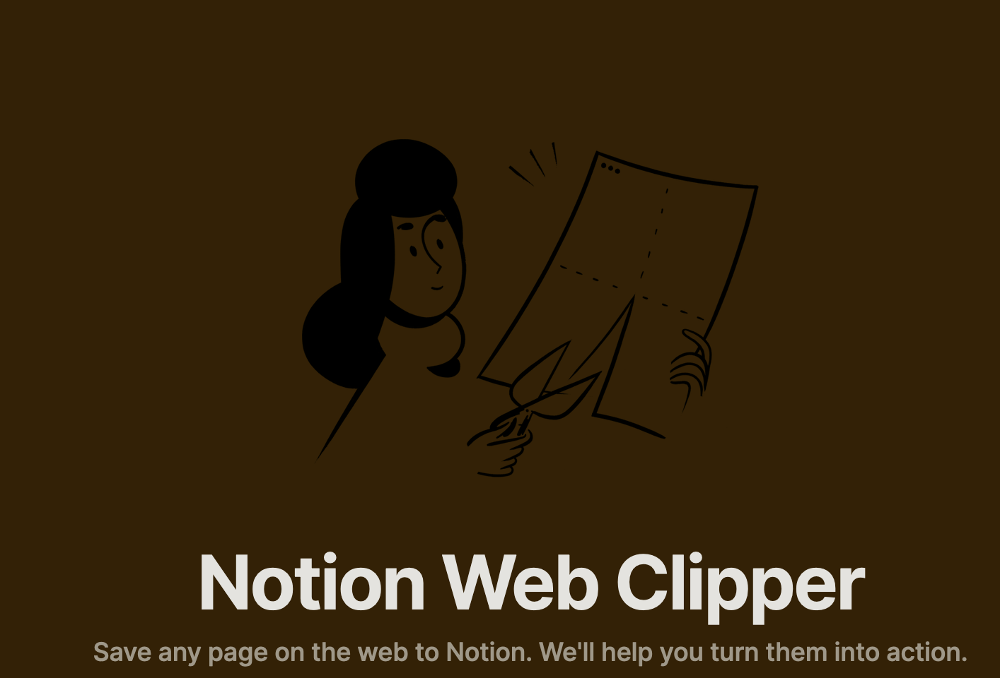

I've decided to move my read-it-later list to Notion. Up until now, I've been a happy user of Pocket but I'm starting to feel a need for more in-depth reading. With that end in sight, I was looking for how to leave comments on the videos/articles. I looked for how to do it with Pocket but with no success. Only had a limited highlight system. So I decided to test if Notion was up to the task.

## Integrations

My ideal flow would be:

1. Skim the article, and if it seems interesting, store it.
2. Read it immediately or later in the app. Offline is a great feature plus
3. Add comments as I go. The text and the comments being searchable would be another plus
4. Tag and archive. As I use it to write my reading updates I need programmatic access

And so I gave Notion a try. I frequently read, independently of the time or place, so it was important to be able to send articles from wherever I was which meant integrations for both desktop/mac as well as on my android. And this was my first big surprise.

Both browser extension [web-clipper](https://www.notion.so/web-clipper) as well as the android APP allowed for quick sharing with one big plus. It not only allowed to write to a Notion database with the URL, but it also extracted the text and images and for links like youtube, it would embed it to the page. This is one thing I thought I would lose! And at least for text articles if you open the notion page, it should be cached for later offline access. Great!

## Notion API

I was already happy but I also had one additional feature. I usually pick the articles I liked each week and publish them on a reading update (up until now it's the majority of my articles 😅). For this to be quick, I created a small [pocket CLI](https://pypi.org/project/pocket-newsletter/) that would retrieve all articles and in a second step archive them. It worked but the integration took a bit of time, Pocket didn't have good documentation and I had to take notes from another python project on how to do auth which took me a couple of hours.

However, while looking at Notion API I found a way to do both features in Deno in around 30 minutes! Of course, I want to do some improvements to it but it was a 10/10 Dev experience. You can check both as GISTS:

* [List articles](https://gist.github.com/Cabeda/cc967dd88bd7f0d6f2207fc880124e65)
* [Archive](https://gist.github.com/Cabeda/72d3182a1b727082e99c6dd0792437d4)

## Final thoughts

So now I'm going to be reading my pocket articles and I guess Notion was able to bring me back to them. No matter how much I try, they simply have a do-it-all app that just makes my life easier 😅
