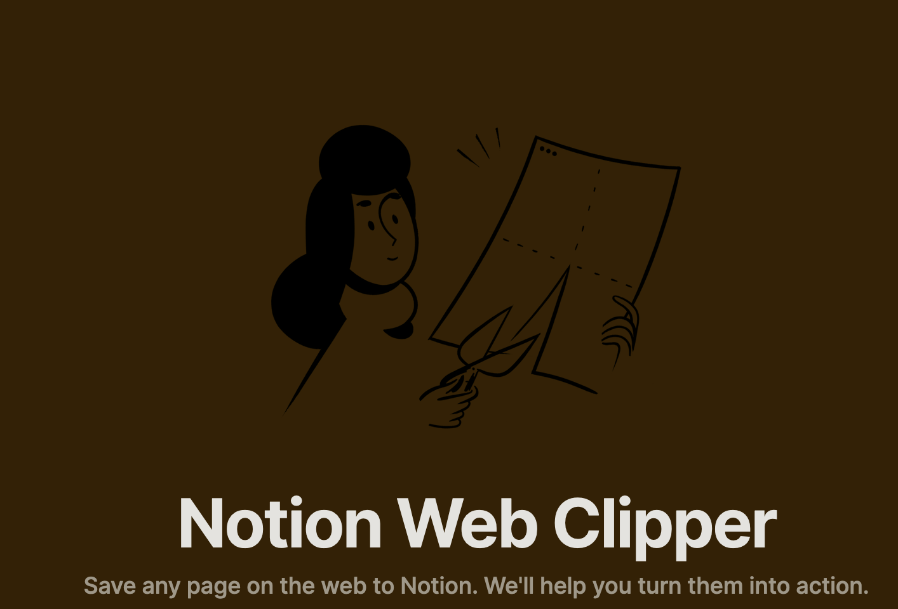

I've decided to move my read-it-later list to Notion. Up until now, I've been a happy user of Pocket but I'm starting to feel a need for more in-depth reading. With that end in sight, I was looking for how to leave comments on the videos/articles. I looked for how to do it with Pocket but with no success. Only had a limited highlight system. So I decided to test if Notion was up to the task.

## Integrations

My ideal flow would be:

1. Skim the article, and if it seems interesting, store it.
2. Read it immediately or later in the app. Offline is a great feature plus
3. Add comments as I go. The text and the comments being searchable would be another plus
4. Tag and archive. As I use it to write my reading updates I need programmatic access

And so I gave Notion a try. As I read from my laptop and on the go,  I need to have notion integrations on all my devices (web and android). And this was my first big surprise.

Both the browser extension [web-clipper](https://www.notion.so/web-clipper) as well as the android APP allow for quick sharing.  I half expected it to write a link but it also added an entry to my Notion database. And extracted its content! This is one thing I thought I would lose! And at least for text articles if you open the notion page, it will cache for offline access. Great!

## Notion API

I was already happy but I also had one more feature. I usually pick the articles I liked each week and publish them on a reading update (up until now it's the majority of my articles 😅). For this to be quick, I created a small [pocket CLI](https://pypi.org/project/pocket-newsletter/) that would retrieve all articles and in a second step archive them. It worked, but the integration was harder due to a lack of documentation, and a complex authentication that took me a couple of hours.

Yet, while looking at Notion API I found a way to do both features in Deno in around 30 minutes! Of course, I want to do some improvements to it but it was a 10/10 Dev experience. You can check both as GISTS:

* [List articles](https://gist.github.com/Cabeda/cc967dd88bd7f0d6f2207fc880124e65)
* [Archive](https://gist.github.com/Cabeda/72d3182a1b727082e99c6dd0792437d4)

## Final thoughts

So now I'm going to be reading my pocket articles and I guess Notion was able to bring me back to them. No matter how much I try, they simply have a do-it-all app that just makes my life easier 😅
