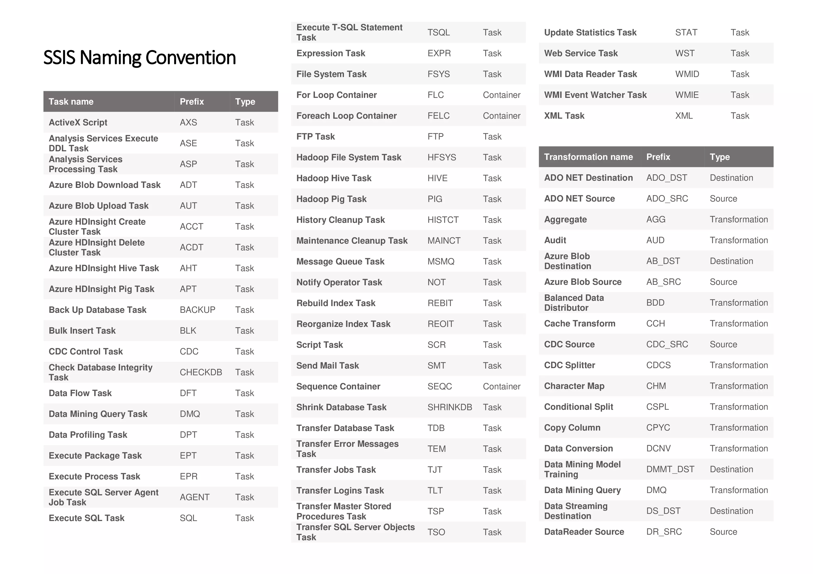
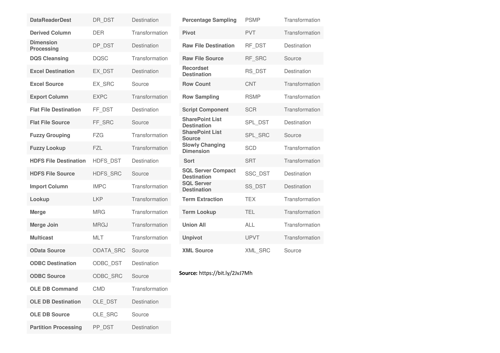

Hi folks!

In the past month I've started doing a project in Business Intelligence. The work of defining the metrics and dimensions had already been laid out but, when creating the ETL (Extract, Transform and Load) I was asked to use the **SSIS Naming Convention**.

This is a simple list of how to name the tasks, but it's one that I've found to help other developers in understading our work. The first version was proposed by Jamie Thomson in 2006 but, as many changes have been done to SQL Server and to SSIS, an updated list was introduced in 2016 by Joost van Rossum, Koen Verbeeck and André Kamman  (original [post](https://bit.ly/2sNErqZ)).

As I love to have cheat sheets I've create the one that follows :

To download click [here](https://bit.ly/2Jhnksv).

I hope this can be useful to someone and if I detect any updates I'll keep it updated :-).
